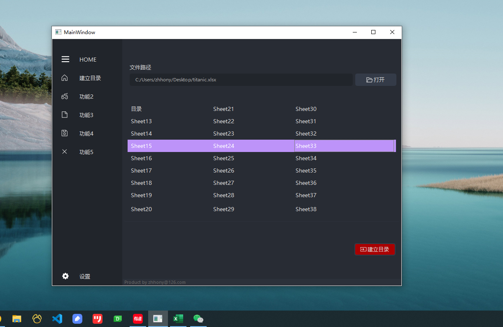

# pyexcel自述

## 一、控制台版

通过 `scripts/pyexcel.py`脚本给Excel文件建立目录，并建立跳转使用的超链接。此脚本目前支持xls及xlsx格式文件。

可以通过在Windows终端中输入如下命令执行脚本：

```powershell
# 确认好系统里已安装Python。用[python]命令运行pyexcel.py脚本，并输入参数p
python pyexcel.py -p [文件所在路径]
# 范例 python pyexcel.py -p C:\Users\zhhon\Desktop\abc.xlsx
```

## 二、桌面版

为Windows10+平台开发的桌面版应用详见发布页面：

[pyexcel版本管理页面](https://github.com/zhhony/pyxlsx/releases)

进入建立目录的页签，通过打开按钮指定需要建立目录的excel文件，点击建立目录。



## 三、目录逻辑

* 默认会在当前excel文件中新建一个叫做“目录”的sheet，用于存放目录。
* 为了让链接良好闭环，会默认在所有sheet的[A3]单元格建立返回目录的超链接
* 如果检测到已存在“目录”sheet，则会覆盖此sheet
